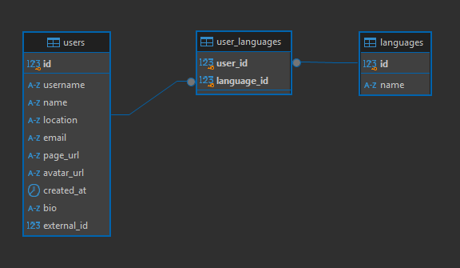

# github-users-db
A simple application to retrieve, persist, and display GitHub users' data via CLI commands. It is designed to run in Node.js (version 18 or higher recommended).

## Installation

To clone and set up the project:

1. Clone the repository:
   ```bash
   git clone <repository-url>
   ```

2. Navigate into the project directory:
   ```bash
   cd github-users-db
   ```

3. Switch to the correct branch:
   ```bash
   git checkout feature/create-cli-app
   ```

## Pre-requisites

Before running any command in your terminal, ensure the following:

- **Node.js** is installed (version 18 or later recommended):
  - Run the command `node -v` in your terminal.
    - If the output is like `v18.xx.y`, you're good to go.
    - Otherwise, you'll need to install Node.js.
      - First, install **NVM**: [NVM Installation Guide](https://github.com/nvm-sh/nvm)
      - Then, use NVM to install Node.js.

- **Docker** and **Docker Compose** are installed and ready:
  - If you don’t have Docker or Docker Compose, please follow these links:
    - [Get Docker](https://docs.docker.com/get-docker/)
    - [Install Docker Compose](https://docs.docker.com/compose/install/)

- You have a **GitHub Personal Access Token (Classic)**:
  - If you haven't created one yet, follow the guide here: [Creating a Personal Access Token (Classic)](https://docs.github.com/en/authentication/keeping-your-account-and-data-secure/managing-your-personal-access-tokens#creating-a-personal-access-token-classic)

- You've created a `.env` file in the project root directory with the following variables:
  ```bash
  GITHUB_API_TOKEN="your GitHub personal access token"
  DB_HOST=localhost
  DB_PORT=5432
  DB_NAME=github-db
  DB_USER=postgres
  DB_PASSWORD=postgres
  ```

## Setting up the Local Environment
To get the application ready to run, follow these steps:
1. Run ``npm install`` to install the required Node packages.
2. Run ``docker compose up -d`` to start the database container.
3. Run ``npm run migrations`` to create the necessary database tables.
    - Alternatively, you can run ``npm run migrations:seeds`` to also seed the database with fictional data.

4. Run ``npm link`` to make the CLI application globally available (you will then be able to run it using the ``gh-users`` command).

## Running the CLI App
### Main Commands
Once all pre-requisites are set up, you can use the following commands in your terminal:
- ``gh-users fetch <GitHub username>``: Fetch a user's data from GitHub (using the official public API) and persist it in your local PostgreSQL database.
  - Example: ``gh-users fetch fernando-mashimo``

- ``gh-users list``: Fetch and display a list of all users stored in the database.
  - You can filter the results by using optional parameters:
    - ``-l <location>`` or ``--location <location>``: Filter users by location.
    - -``p <programmingLanguage>`` or ``--programmingLanguage <programmingLanguage>``: Filter users by programming language.
    - Example: ``gh-users list -l US -p Java``
      - Expected behavior: Fetches and displays users who are located in the US and have experience with Java.

## Running Tests
Currently, there a few tests that may be run through the command:
- ``npm run test <testFileName.test.ts>``: Run tests using Jest.

## Other project commands (scripts)
- ``npm run lint``: Check the code for compliance with the defined formatting rules:
  - Max line length: 80 characters.
  - Indentation: 2 spaces (no tabs).
- ``npm run reset-db``: Reset the database by purging its tables. Afterward, run ``npm run migrations`` to recreate the tables.

## Database Structure (ERD)



## Technical choices
### Commander.js (CLI Tool)
Commander.js is a popular npm package used to build CLI applications in Node.js. While it is possible to create a CLI parser using process.argv, Commander.js was chosen for this project due to its reliable and easy-to-use functionality. It simplifies command definition, argument handling, and help message display, which helps reducing development time, improves maintainability, and enhances the user experience. 🚀

## Troubleshooting

- ### Problem: `gh-users` command not found after running `npm link`.

  **Solution**: Try running `npm link` again and ensure that the npm global bin directory is in your `PATH`.

  ### Steps to ensure npm global bin directory is in your PATH:

  #### For Linux/macOS:
  1. Run the following command to find the npm global bin directory:
      ```bash
      npm config get prefix
      ``` 
     You should see a path like /home/username/.nvm/versions/node/v18.xx.y.

  2. Add this directory to your PATH by running the following command:
      ```bash
      echo 'export PATH="$PATH:<npm-global-bin-path>"' >> ~/.bashrc
      ```
      Or for Zsh users (macOS defaults to Zsh):
      ```bash
      echo 'export PATH="$PATH:<npm-global-bin-path>"' >> ~/.zshrc
      ```
  3. After that, run:
      ```bash
      source ~/.bashrc  # or source ~/.zshrc for Zsh
      ```
  4. Now, try running ``gh-users`` again.

  #### For Windows:
  1. Open a command prompt and run the following:
      ```bash
      npm config get prefix
      ```
      You should see a directory like ``C:\Users\<YourUsername>\AppData\Roaming\npm``.

  2. Add this directory to your ``PATH`` environment variable:
      - Right-click on This PC or Computer, and select Properties.
      - Click on Advanced system settings and then on Environment Variables.
      - In the User variables section, select Path and click Edit.
      - Add the npm bin directory path (C:\Users\<YourUsername>\AppData\Roaming\npm), and click OK.
  3. Restart your command prompt or terminal, and then try running ``gh-users`` again.

- ### Problem: Database connection issues.

  **Solution**: Double-check your ``.env`` file configuration, especially the ``DB_HOST``, ``DB_PORT``, ``DB_NAME``, ``DB_USER``, and ``DB_PASSWORD`` values. Ensure that the Docker container is running correctly with:
    ```bash
    docker compose ps
    ```